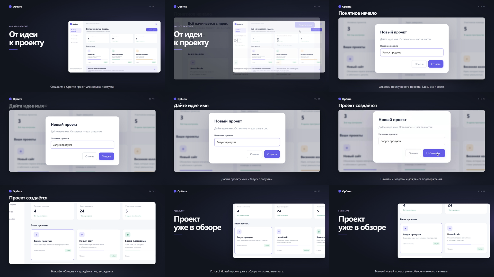

# Product Demo Skill — из кода продукта в готовое видео

Переносимый Skill для демонстраций веб-продуктов с русской озвучкой и монтажом Remotion. Рабочая цепочка: **изучение кода → монтажный лист → запись сайта → отбор → озвучка → проверочный фрагмент → монтаж → MP4 → техническая и редакционная приёмка**.

Работает с локальным Codex и предусматривает установку в Claude Code. GLM подключается через клиент с файловыми инструментами, например OpenCode или Claude Code с Z.AI. Это Skill и локальный исполнитель. Свой LLM API toolkit не вызывает.

## Монтаж и приёмка в 0.4

Обновлённый Skill сначала разбирает продукт и составляет монтажный лист, затем отбирает реальные действия и проверяет короткий сложный фрагмент. Рабочий экран сохраняет пропорции; камера неподвижна по умолчанию, а приближение требует конкретной цели. Источники выбираются явно. Конец клипа удерживается на его последнем кадре. Сцены больше не растягиваются равными пустыми паузами.

`inspect` проверяет файл, но не объявляет монтаж одобренным. Команда `review --init` создаёт отдельную проверку содержания, кадрирования, движения и звука. После реального просмотра/прослушивания её импортируют через `review --file`, затем повторяют `inspect`. Проверка привязана к SHA-256 экспорта; изменение видео аннулирует старую оценку. Если обычное воспроизведение или прослушивание недоступно, статус остаётся `review-candidate`. [Монтаж и диагностика](skills/product-demo/references/editing.md), [правила приёмки](skills/product-demo/references/qa.md).

Обновление существующей установки: получите новую версию, выполните `npm ci`, `npm run build`, затем `node dist/cli.js skill install --client both --scope user`. Старые записи можно перемонтировать без capture/TTS. Старый неявный выбор источников и слишком короткие планы теперь требуют осмысленной правки; [миграция и пример проверки](docs/EDITING_RU.md).

## Посмотреть результат

[Готовое видео: Орбита, женская русская озвучка, 1080p/60](assets/demo-orbita-1080p60.mp4). Файл также входит в релиз. Показан реальный браузерный сценарий с монтажом из записи и снимков интерфейса. Исходная запись — около 25 fps. Это **гибридное видео**, а не native capture 144 fps.



## Главное правило: сначала понять проект

Агент читает инструкции репозитория, команду запуска, маршруты, ключевые компоненты и логику выбранной функции. Затем объясняет, кому нужен продукт, какую задачу покажет ролик, какие действия приведут к результату и по какому признаку результат подтверждается. Случайное кликанье и повторные рендеры не заменяют этот этап.

Toolkit сохраняет `demo.understanding.json` с диапазонами изученных строк, хешами файлов, обоснованием запуска и связью действий со сценарием. Черновик не проходит проверку. Отсутствующий, неполный или устаревший разбор блокирует запись и рендер. Изменение URL, действий или изученного кода требует актуализации разбора. Хеши подтверждают происхождение сведений; сами по себе они не доказывают, что модель правильно поняла продукт.

Перед записью агент проводит один проход сценария в браузере без записи и исправляет конкретную причину ошибки. Для стадий `capture` и `render` лимит исполнителя — два неудачных/оборванных запуска при одинаковых входах, максимум четыре неудачи каждой стадии в каталоге запуска. Успешные повторения лимит не расходуют. Нельзя обходить ограничение созданием новых папок: остановитесь, опишите причину и пересмотрите сценарий. [Полный процесс работы](docs/WORKFLOW_RU.md).

## Что лежит в репозитории

| Путь | Назначение |
|---|---|
| `skills/product-demo/` | Skill, справочники, пример storyboard, launcher |
| `src/` | CLI, запись, озвучка, планирование, Remotion, QA, установка |
| `examples/` | Два работающих локальных продукта: Орбита и Форма |
| `schemas/` | JSON-схемы артефактов |
| `tests/` | Проверки границ, кеша, качества, установки и разбора |
| `scripts/` | Помощники нейросетевой и локальной озвучки |
| `docs/` | Русские инструкции подключения и эксплуатации |
| `assets/` | Готовое видео и кадры для просмотра |

Ключи, сессии входа, пользовательские профили, кеши зависимостей и локальные рабочие результаты в Git не входят. Для сборки зафиксированы исходники и lockfile. Архив toolkit в Releases содержит собранный исполнитель.

## Установить и подключить

Проверенная среда — Windows. Нужны Node.js 22+, npm и FFmpeg/ffprobe. Для записи подходит Chromium либо Microsoft Edge; для рендера рекомендуется Chromium с headless shell из Playwright. Python 3.10+ нужен для `edge-neural`. Установка компонентов: [первый запуск](docs/GETTING_STARTED_RU.md).

```powershell
git clone https://github.com/maksimpotap877-sketch/product-demo-skill.git
Set-Location product-demo-skill
npm ci
npx playwright install chromium
npm run build
node dist/cli.js doctor
node dist/cli.js setup
node dist/cli.js skill install --client codex --scope user
node dist/cli.js skill status --client codex --scope user --json
```

`setup` проверяет браузер для записи и не скачивает Playwright Chromium, если доступный Edge запускается. Это не проверка браузера Remotion: даже `browser: passed` у `doctor` не подтверждает рендер. При первом развёртывании выполните указанную установку Chromium, затем проверьте реальную сцену командой `proof` до полного экспорта. Если Edge записывает сайт, но Remotion не запускается, установите Chromium из каталога toolkit и повторите проверочный рендер после диагностики. FFmpeg, Node и Python устанавливаются отдельно. TTS использует изолированное пользовательское Python-окружение.

Для Claude Code используйте `--client claude`. Для обоих клиентов — `--client both`: два каталога Skill и один runtime. Установка в один проект: `--scope project --project 'C:/Projects/MyProduct'`.

| Клиент | Каталог Skill | Вызов |
|---|---|---|
| Codex | `~/.agents/skills/product-demo` | `$product-demo` |
| Claude Code | `~/.claude/skills/product-demo` | `/product-demo` |
| GLM через OpenCode | Поддерживаемый OpenCode каталог `.agents/skills` либо `.claude/skills` | Попросить загрузить `product-demo` |

На Windows `~` обычно соответствует `$env:USERPROFILE`. Если Skill не появился, начните новую сессию клиента. Runtime устанавливается отдельно от папки разработки. Копировать исходный toolkit в каждый продукт не нужно. [Обновление, резервные копии и удаление](docs/INSTALL_RU.md).

**Все подключения Codex, Claude Code, GLM/Z.AI, Remotion Skills и MCP:** [docs/clients.md](docs/clients.md). Там приведены команды, адреса, каталоги, проверка соединения и границы тестирования. Пароли и ключи вводятся в штатном локальном интерфейсе клиента, не в чате и не в конфигурации видео.

## Запрос агенту в другом проекте

Откройте продукт в Codex и отправьте:

> $product-demo Создай русское демо этого продукта на 30 секунд. Сначала прочитай код и инструкции проекта, объясни пользу продукта, выбери один законченный сценарий и заполни demo.understanding.json со ссылками на изученные файлы. Проверь сценарий в браузере без записи. Затем сделай видео с женской нейросетевой озвучкой и спокойным монтажом. Разрешаю отправить сервису озвучки публичный текст этого демо. Не отправляй приватные данные. Подготовь web-60 и отчёт QA. Частоту исходной записи и частоту рендера укажи отдельно. При ошибке найди причину; не повторяй попытки вслепую.

В Claude Code используйте `/product-demo`. В OpenCode с GLM попросите загрузить Skill `product-demo`. Модель должна иметь доступ к файлам и терминалу. Обычный веб-чат таких инструментов от чтения Markdown не получает.

## Проверить на встроенном сайте

Из корня репозитория создайте отдельный учебный проект:

```powershell
node dist/cli.js init --project 'C:/Projects/DemoTraining' --example basic
node dist/cli.js analyze --project 'C:/Projects/DemoTraining' --source demo-site/server.mjs --source demo-site/basic-web/index.html --json
```

`init` копирует сервер и страницу в `demo-site/`, создаёт конфигурацию и не заменяет существующую. `analyze` читает исходники и создаёт **черновик** с проверяемыми ссылками. Агент читает выведенные фрагменты и заполняет смысловые поля: продукт, аудиторию, результат, безопасный запуск, действия. Просто заменить `draft` на `ready` недостаточно. [Формат и пример заполнения](docs/WORKFLOW_RU.md).

После содержательного заполнения и проверки сценария:

```powershell
node dist/cli.js analyze --validate --project 'C:/Projects/DemoTraining' --json
node dist/cli.js all --project 'C:/Projects/DemoTraining' --run output/first-demo --profile web-60 --tts-provider edge-neural --allow-external-tts
node dist/cli.js preview --project 'C:/Projects/DemoTraining' --run output/first-demo
```

Preview выводит адрес `127.0.0.1` и работает до остановки процесса. Результаты лежат в `C:/Projects/DemoTraining/output/first-demo/`. Для своего продукта замените URL, запуск, locators, действия и storyboard на исследованный сценарий. Не используйте учебный `init` вместо исследования реального приложения.

## Команды и артефакты

При разработке команды запускаются через `node dist/cli.js`. После установки:

```powershell
$demoLauncher = Join-Path $env:USERPROFILE '.agents/skills/product-demo/scripts/run.mjs'
node $demoLauncher --help
node $demoLauncher doctor
```

| Команда | Назначение |
|---|---|
| `doctor`, `setup` | Проверка среды и компонентов |
| `discover --project <папка>` | Начальные сведения; не заменяет чтение реализации |
| `init --example basic` | Учебный сайт и конфигурация |
| `analyze --source <файл>` | Фрагменты кода и черновик понимания; флаг повторяется |
| `analyze --source-range <файл:начало:конец>` | Явный диапазон строк реализации; флаг повторяется |
| `analyze --validate` | Проверка заполнения, привязок и актуальности разбора |
| `auth --mode login` | Видимое окно входа без записи |
| `benchmark --target-fps 144` | Измерение обновлений источника |
| `capture` | Браузер, клипы, screenshots, события |
| `voices preview` | Пробы настоящих голосов |
| `narrate --run <папка>` | Речь из storyboard или импорт аудио |
| `plan --run <папка>` | Монтажный план по измеренным длительностям |
| `render --run <папка>` | Remotion и звуковой микс |
| `inspect --run <папка>` | Технический QA и contact sheet |
| `preview --run <папка>` | Локальное воспроизведение результатов |
| `all`, `resume --run <папка>` | Полный процесс или возобновление |
| `skill install/status/uninstall` | Установка и обслуживание Skill |

Основные флаги: `--project`, `--config`, `--analysis`, `--run`, `--output`, `--profile`, `--duration`, `--voice female|male`, `--voice-id`, `--speech-rate`, `--tts-provider`, `--allow-external-tts`, `--narration-file`, `--strict-native-fps`, `--dry-run`, `--json`. Подробности: `--help`.

Поддерживаются JSON и доверенная TypeScript-конфигурация. `.ts` выполняется с правами пользователя: неизвестные конфигурации исполнять нельзя. Структуры экспортируются пакетом и описаны в `schemas/`.

Запуск сохраняет конфигурацию, storyboard, текст речи, `capture/`, `narration/`, `edit-plan*.json`, `audio/`, `subtitles/`, `renders/`, `review/`, checkpoint и журнал попыток. Основные результаты: `renders/demo-web-60-degraded.mp4`, `review/quality-report.json`, `review/quality-report.md`. Маркер `degraded` отражает ограничения источника.

## Русская озвучка и повторный монтаж

Проверенный женский голос — `ru-RU-SvetlanaNeural`, мужской — `ru-RU-DmitryNeural`; провайдер `edge-neural`, клиент `edge-tts` 7.2.8. В выполненных проверках ключ и плата за синтез не требовались. Это сторонний клиент Microsoft Edge, не официальный Azure API. Доступность и права использования зависят от сервиса. Подмена сетевой ошибки роботизированным SAPI запрещена. Рейтинг «лучший голос в мире» не заявляется.

Текст отправляется только с `--allow-external-tts` либо соответствующим разрешением в конфигурации. Адаптер не отправляет сайт, снимки и видео. Без внешнего TTS можно импортировать свой WAV/MP3. Старый `windows-sapi` оставлен как явно выбранный офлайн-вариант.

Для правки речи измените `storyboard.json`, выполните `narrate`, `plan`, `render`, `inspect`. Кеш обновит изменённые реплики. Для правки камеры редактируйте `edit-plan-<profile>.json`, затем выполните `render` и `inspect`. Повторная запись сайта не нужна. Запускам до версии 0.3 потребуется разбор проекта перед новым рендером.

Музыка необязательна: локальный файл пользователя с подходящими правами. Есть fade, приглушение под речь и измеряемая нормализация. [Озвучка](docs/narration.md), [исследованные голоса](docs/neural-voice-research.md).

## Native capture 144 fps и render 144 fps

Это независимые свойства. Remotion может собрать 2560×1440/144 fps. Из этого не следует, что запись содержит 144 новых состояния интерфейса каждую секунду.

Проверенный Playwright backend даёт исходник около 25 fps. Native-144 benchmark не прошёл. Скриншоты высокого разрешения и плавная камера не меняют частоту записанного движения. `--strict-native-fps` блокирует неподтверждённый native-результат; полный pipeline может сохранить честно отмеченный гибридный артефакт с кодом выхода 3.

Профили: `web-60` — 1920×1080/60; `master-144` — 2560×1440/144; `vertical` — 1080×1920/60; `square` — 1080×1080/60; `4k-60` — 3840×2160/60. Наличие профиля не означает проведённый E2E: каждому нужен отдельный просмотр. [Подробности записи](docs/capture.md).

## Remotion и MCP

Remotion включён в зависимости и действительно выполняет монтаж локально. Официальный Remotion MCP предоставляет поиск документации, а не дистанционное редактирование видео. Ранее выполнены реальный handshake и запрос документации. MCP помечен авторами deprecated; для новой установки используйте официальный Skill `remotion-docs`. [Команды подключения, проверка и первоисточники](docs/clients.md#remotion-документация-skills-и-необязательный-mcp).

## Проверки и ограничения

QA различает `passed`, `failed`, `blocked`, `not-tested`, `degraded`. Автоматически проверяются decode, размеры, временные метки, число кадров, длительность, звук и границы источников. Contact sheet не доказывает плавность; ffprobe не заменяет прослушивание. Непросмотренные и непрослушанные качества остаются `not-tested`. [Фактический статус версии](docs/VERIFICATION_RU.md).

Вход выполняет пользователь в отдельном видимом окне без видео, screenshots, trace/HAR и записи полей во время авторизации. Секреты не запрашиваются в чате. Профили отделены от результатов, preview раздаёт только разрешённые артефакты на loopback. Внешние логины не считаются проверенными по учебному входу. Используйте согласованные сценарии и безопасные тестовые данные.

Windows E2E выполнен. Установка формата Claude Skill не доказывает E2E внутри Claude/GLM. macOS/Linux и все возможные сайты не объявляются проверенными. Лицензии компонентов: [THIRD_PARTY_NOTICES.md](THIRD_PARTY_NOTICES.md).

## Разработчику и агенту

```powershell
npm ci
npm run typecheck
npm test
npm run build
```

Сетевой тест синтеза включается явно через `PRODUCT_DEMO_TEST_NEURAL=1`. При изменении схем обновите JSON-схемы, инструкции и проверки. Проверяйте установленный runtime из другого проекта и содержимое `npm pack --dry-run`.

Стартовые инструкции: [CODEX.md](CODEX.md), [CLAUDE.md](CLAUDE.md). Полный процесс: [WORKFLOW_RU.md](docs/WORKFLOW_RU.md). Подключения: [clients.md](docs/clients.md). [История изменений](CHANGELOG.md).
